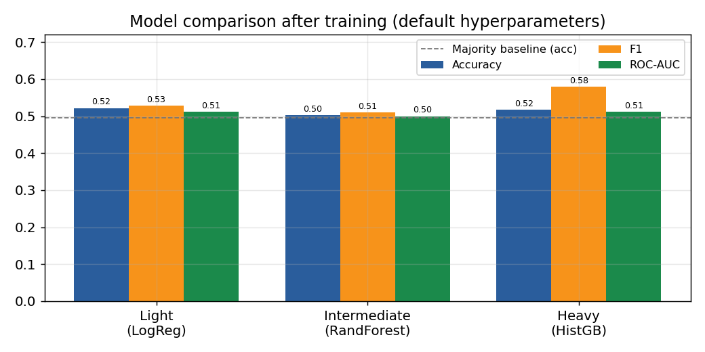
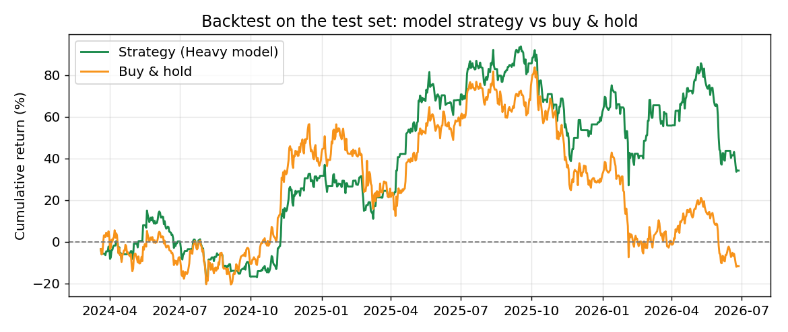
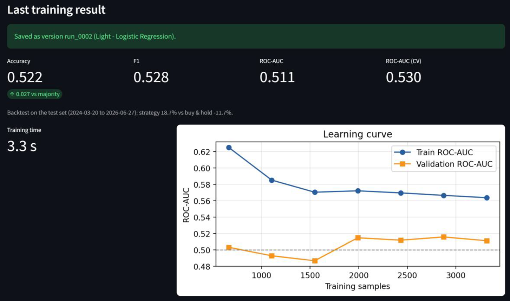
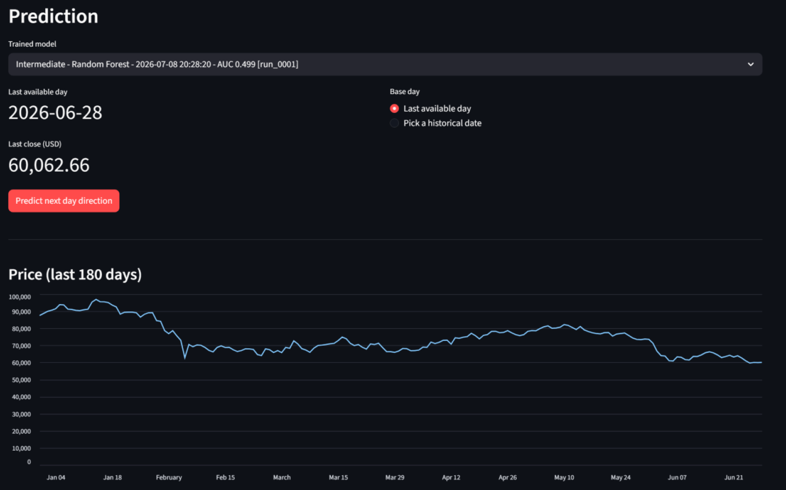

# BTC Direction Predictor

Aplicação de *machine learning* que tenta prever se o preço do Bitcoin fecha amanhã acima ou abaixo de hoje. Compara três famílias de modelos do scikit-learn e disponibiliza tudo numa aplicação Streamlit: preparação dos dados, treino (manual ou AutoML), previsão, comparação de modelos e histórico de previsões.

Trabalho prático de **Inteligência Artificial** (3.º ano da Licenciatura em Engenharia Informática, ESTG – Politécnico do Porto, época especial de 2025/26), revisto em 2026.

[](https://github.com/fmpoliveira05-jpg/btc-direction-predictor/actions/workflows/ci.yml)

**Experimentar sem instalar nada:** [demonstração web](https://fmpoliveira05-jpg.github.io/btc-direction-predictor/). A aplicação corre toda no browser (a primeira abertura demora 20 a 40 segundos a carregar o Python), já traz os três modelos treinados e os dados são atualizados todos os dias.

## O enunciado

Escolher um *dataset* de um problema supervisionado, analisá-lo e prepará-lo, treinar pelo menos três modelos, avaliá-los de forma fundamentada e construir uma aplicação que permita a um utilizador obter previsões. Eram valorizados: escolher o modelo, ver as métricas de cada um, consultar o histórico de previsões e acrescentar dados para treinar uma nova versão. Todos estes extras estão implementados.

## Os dados e o problema

- **Origem:** [Bitcoin Historical Data](https://www.kaggle.com/datasets/mczielinski/bitcoin-historical-data) (Kaggle), com preços ao minuto desde 2012 (~7,6 milhões de linhas, ~386 MB).
- **Preparação:** reamostragem para velas diárias, remoção do período anterior a 2015 (pouca liquidez, preços "congelados") e preenchimento dos dias em falta.
- **Features (25):** retornos e retornos desfasados, rácios preço/média móvel, volatilidade, RSI, MACD, posição nas bandas de Bollinger, amplitude diária, variação de volume e dia da semana. Todas usam apenas informação disponível até ao fim do dia.
- **Alvo:** `1` se o fecho de amanhã for superior ao de hoje, `0` caso contrário (52,9 % de dias "sobe" no treino, por isso as classes estão praticamente equilibradas).

Os CSV diários já processados estão em `data/`; o ficheiro ao minuto não está incluído por causa do tamanho. O *dataset* do Kaggle é atualizado todos os dias e é público: a aplicação (separador Data) ou `python src/data_pipeline.py --kaggle` descarregam a versão mais recente sem conta. O último dia do ficheiro ainda está incompleto quando o Kaggle o atualiza, por isso é descartado: uma vela parcial daria um fecho e um volume errados.

## Metodologia

Em séries temporais financeiras é muito fácil obter resultados enganadoramente bons. Por isso:

1. **Divisão temporal**: treino de 2015-02 a 2024-03 (3317 dias) e teste de 2024-03 a 2026-06 (830 dias). Nunca há baralhamento.
2. **Validação cruzada *walk-forward*** (`TimeSeriesSplit`, 5 partições, com um dia de intervalo entre treino e validação, porque o alvo de um dia depende do fecho do dia seguinte).
3. **Pipelines do scikit-learn**: a normalização é ajustada apenas nos dados de treino de cada partição.
4. **Seleção pelo treino, avaliação pelo teste**: os hiperparâmetros e o melhor modelo são escolhidos pela validação cruzada; o conjunto de teste só é usado uma vez, no fim.
5. **Baselines**: classe maioritária e persistência ("amanhã faz o mesmo que hoje").
6. **Backtest simples**: comprar quando o modelo prevê subida e ficar de fora caso contrário, comparado com *buy & hold*.

| Família | Modelo | Papel |
|---|---|---|
| Leve | Regressão logística | *baseline* linear e interpretável |
| Intermédia | Random Forest | não linear, robusto a ruído |
| Pesada | HistGradientBoosting | o mais expressivo dos três |

## Resultados

Resultados de `python src/train_models.py` (afinação com *grid search*):

| Modelo | ROC-AUC (validação cruzada) | ROC-AUC (teste) | Exatidão (teste) | Backtest (teste) |
|---|---|---|---|---|
| Classe maioritária | – | 0,500 | 49,5 % | – |
| Persistência | – | 0,494 | 49,4 % | – |
| Regressão logística | 0,534 | 0,511 | 51,2 % | −0,8 % |
| Random Forest | **0,542** | 0,500 | 50,2 % | +5,2 % |
| HistGradientBoosting | 0,537 | 0,511 | 51,7 % | +34,2 % |
| *Buy & hold* | | | | −11,7 % |

**A leitura honesta destes números é que nenhum modelo prevê a direção diária do Bitcoin de forma útil.** Os três ficam praticamente ao nível do acaso no conjunto de teste, e o pequeno ganho visto na validação cruzada (0,53–0,54) não se mantém no período mais recente, o que é consistente com mercados muito eficientes e com uma relação entre features e alvo que muda ao longo do tempo. O bom resultado do backtest do HistGradientBoosting parece dever-se sobretudo a ter ficado de fora em algumas quedas grandes do período de teste (ver gráfico abaixo) e não deve ser lido como uma estratégia rentável.

Mais do que "acertar no Bitcoin", o objetivo do projeto é demonstrar um processo de avaliação que não se engana a si próprio: baselines, validação temporal, seleção sem tocar no teste e interpretação crítica dos resultados.

| Comparação dos modelos | Backtest no período de teste |
|---|---|
|  |  |

*(Gráficos produzidos no relatório original, com os hiperparâmetros por omissão.)*

## A aplicação

```bash
pip install -r requirements.txt
streamlit run app/app.py
```

A interface está em inglês e organiza-se em cinco separadores, que devem ser usados por esta ordem:

1. **Data** – descarregar a versão mais recente do *dataset* do Kaggle (sem conta; o token só é pedido se o Kaggle exigir autenticação e nunca é gravado) ou reprocessar um CSV local; ver o processo de preparação; escolher os grupos de features; acrescentar novas linhas de dados.
2. **Training** – escolher a família e ajustar os hiperparâmetros, ou usar o **AutoML** (pesquisa aleatória avaliada por validação cruzada). Mostra a curva de aprendizagem, o tempo decorrido e permite interromper o treino a meio. Cada treino fica guardado como uma nova versão.
3. **Prediction** – escolher uma das versões treinadas e obter a direção prevista para o dia seguinte e a probabilidade de subida, a partir do último dia disponível ou de uma data histórica.
4. **Comparison** – características das três famílias antes do treino e, depois, uma tabela com hiperparâmetros e métricas de todas as versões, com o melhor e o pior valor de cada linha assinalados.
5. **History** – previsões feitas, com a indicação de acerto quando o resultado real já é conhecido e a taxa de acerto acumulada.

Localmente, a aplicação não traz modelos pré-treinados: cada utilizador treina os seus, o que também evita problemas de compatibilidade entre versões do scikit-learn.

### Demonstração no browser

A [demonstração web](https://fmpoliveira05-jpg.github.io/btc-direction-predictor/) é a mesma aplicação a correr no browser com o [Stlite](https://github.com/whitphx/stlite) (Streamlit sobre Pyodide, ou seja, Python compilado para WebAssembly). Não há servidor: o GitHub Pages só entrega os ficheiros, por isso o link está sempre disponível e não adormece.

- Arranca com os três modelos treinados com os hiperparâmetros por omissão (`demo/pretreinar.py`). Foram treinados com as mesmas versões do scikit-learn, NumPy, pandas e joblib que o Pyodide usa (`demo/requirements-pretreino.txt`), para os ficheiros `.joblib` abrirem no browser.
- Treinar também funciona, mas em primeiro plano (o Pyodide não tem *threads*, por isso não há botão para interromper) e com um só processador: a regressão logística demora uns segundos e a Random Forest cerca de meio minuto. O que se treina perde-se ao recarregar a página.
- O descarregamento do Kaggle só funciona localmente; a demonstração usa os dados diários já processados.
- Todos os dias, depois da atualização do Kaggle, o workflow `demo-pages.yml` descarrega os dados mais recentes, volta a treinar os três modelos e republica o site (`demo/montar-site.sh` junta os ficheiros). Não faz commits: os dados novos vão só para o site. Se o Kaggle falhar, publica com os dados do repositório. O segredo `KAGGLE_API_TOKEN` é opcional e só é preciso se o Kaggle passar a pedir autenticação.

| Treino | Previsão |
|---|---|
|  |  |

*Capturas de uma execução de exemplo; os valores mudam com os dados e os hiperparâmetros escolhidos.*

### Linha de comandos

```bash
python src/data_pipeline.py --kaggle                           # descarrega a versão mais recente e gera os CSV diários
python src/data_pipeline.py [caminho/btcusd_1-min_data.csv]   # o mesmo, a partir de um ficheiro já descarregado
python src/train_models.py                                     # treina e avalia os três modelos
```

## Estrutura

```
src/
  features.py       preparação dos dados e features (usada pelo pipeline e pela aplicação)
  modeling.py       treino, avaliação, AutoML, curva de aprendizagem e registo de versões
  data_pipeline.py  CSV ao minuto → CSV diários
  train_models.py   treino completo com grid search e escrita de models/metrics.json
app/app.py          aplicação Streamlit
demo/               demonstração web (página Stlite, modelos pré-treinados e script de montagem)
data/               dados diários processados
models/             registry.json (versões treinadas na aplicação) e metrics.json
tests/              testes pytest
docs/figuras/       gráficos usados no relatório
```

## Testes

```bash
pip install -r requirements-dev.txt
pytest
```

Os 22 testes verificam, entre outras coisas, que **as features não usam informação do futuro** (alterar os preços a partir de um dia não pode mudar as features dos dias anteriores), que o alvo está correto, que a vela incompleta do último dia é descartada, que a divisão treino/teste respeita a ordem temporal, que as três famílias treinam e produzem métricas, que o AutoML pode ser interrompido e que o registo de versões funciona. Há ainda um teste de fumo que arranca a aplicação Streamlit sem browser e dois que confirmam que os ficheiros da demonstração web existem e são coerentes.

## O que mudou na revisão de 2026

- O melhor modelo passou a ser escolhido pela validação cruzada; antes era escolhido pelo resultado no conjunto de teste, o que torna a avaliação final otimista.
- A validação cruzada passou a ter um dia de intervalo entre treino e validação.
- A função `automl` usava uma variável que não recebia (`NameError`) e tinha o mesmo código que `automl_stoppable`; passou a reutilizá-la. Foi removida uma função de gravação antiga que já não funcionava.
- Os scripts de linha de comandos tinham caminhos absolutos de outra máquina e repetiam o código de `features.py` e `modeling.py`; agora usam caminhos relativos ao projeto e os mesmos módulos que a aplicação.
- O ROC-AUC deixou de rebentar quando um conjunto só tem uma classe, e os identificadores das versões deixaram de poder repetir-se.
- Acrescentados testes automáticos, integração contínua e este README.
- Acrescentada a demonstração web no GitHub Pages, sem servidor, com os dados atualizados todos os dias.
- O último dia do ficheiro do Kaggle, ainda incompleto, deixou de entrar nos dados; o token do Kaggle passou a ser opcional; a aplicação e a linha de comandos passaram a usar o mesmo código para ler o ficheiro ao minuto.

## Autor

**Francisco Miguel Pereira Oliveira** – [GitHub](https://github.com/fmpoliveira05-jpg)
